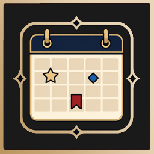
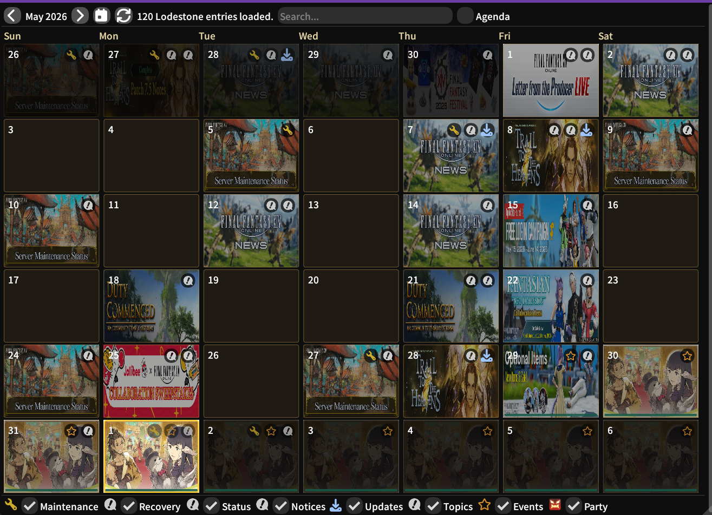

# Lodestone Calendar

<p align="center">
  
</p>

Lodestone Calendar is a Dalamud plugin that brings the official FINAL FANTASY XIV Lodestone into an in-game calendar. It can show seasonal events, topics, notices, maintenance, recovery, status posts, update posts, personal notes, alarms, and shared party plans.

The goal is simple: make FFXIV's Lodestone feel more like an in-game MMO calendar, with images, reminders, and useful day-by-day details instead of making you keep a browser open.

## Preview



## Install

Add this custom repository in Dalamud:

```text
https://raw.githubusercontent.com/BalthierArt/Leonhart/main/repo.json
```

After adding the repository, install `Lodestone` from Dalamud's plugin installer.

GitHub repository:

[https://github.com/BalthierArt/lodestone](https://github.com/BalthierArt/lodestone)

## Features

### Lodestone Calendar

Choose what Lodestone sections the plugin pulls into the calendar:

- Events
- Topics
- Notices
- Maintenance
- Recovery
- Status
- Updates

Each day can show Lodestone artwork, category icons, and event start/end markers. Clicking a day opens details for the items on that date, and clicking a Lodestone entry can open a styled details window with the original Lodestone link.

### Display Priority

When several posts land on the same day, you can control which type wins the day image and appears first. For example, you can make updates show above news, or make a seasonal event start day take priority over ordinary posts.

The plugin also has priority rules for common Lodestone posts, so repeated topics are less likely to hide the things you actually care about.

### Notes And Alarms

Right-click a day to add a personal note, such as `Raid Night`, `Maps`, or `Static Trial Practice`.

Notes can include a time, and alarms can remind you before the event starts. Use this to avoid missing raid time again because you were lost in roulettes, crafting, or inventory cleanup.

### Party Events

Right-click a day and choose `Plan Party Event` to create a shared party plan. Pick a Party Finder-style icon, add a title, add details, and let other players mark themselves as:

- Interested
- Maybe
- Removed

This was inspired by the World of Warcraft calendar style: one person creates an event, and the group can see who is interested or maybe attending.

Party Sync is experimental and still an ongoing project. It is built to support two sharing options:

### Party Sync Option 1: Supabase

Supabase is a small cloud database/backend service. In simple terms, it is a shared online box where Lodestone can store party events for a group key.

If you use Supabase mode, Lodestone can upload and download shared party events directly through that backend. It does not upload your local notes or scraped Lodestone calendar data.

### Party Sync Option 2: Mod Sync Plugins

Lodestone also exposes local Dalamud IPC for other plugins to use. This means a bridge or sync plugin could grab Lodestone party event data and share it through that plugin's existing group/key system.

If a mod sync bridge supports Lodestone IPC in the future, you may not need Supabase at all. The bridge plugin could handle the sharing, and Lodestone would just provide the event data and UI.

Developers and bridge authors can read the IPC details here:

[IPCreadme.md](IPCreadme.md)

### Quest Lookup

Event details can try an experimental quest lookup through Gamer Escape. When it works, it can show quest requirements, rewards, objectives, and location text.

This feature depends on Gamer Escape allowing the request. If the site blocks or rate-limits the lookup, Lodestone will show a friendly failure message and you can try again later.

### Customization

The settings window lets you adjust how the calendar feels:

- Change day colors and highlight colors
- Use short or full weekday names
- Control how dark non-current-day images appear
- Show text only on hover for a cleaner calendar
- Choose which Lodestone categories appear
- Adjust refresh and cache settings
- Control server bar/DTR behavior

## Notes

Lodestone Calendar reads public Lodestone pages and stores a local cache so it does not need to scan constantly. The default refresh interval is once every 24 hours.

Personal notes stay local. Party events are only shared if you enable a Party Sync option.
